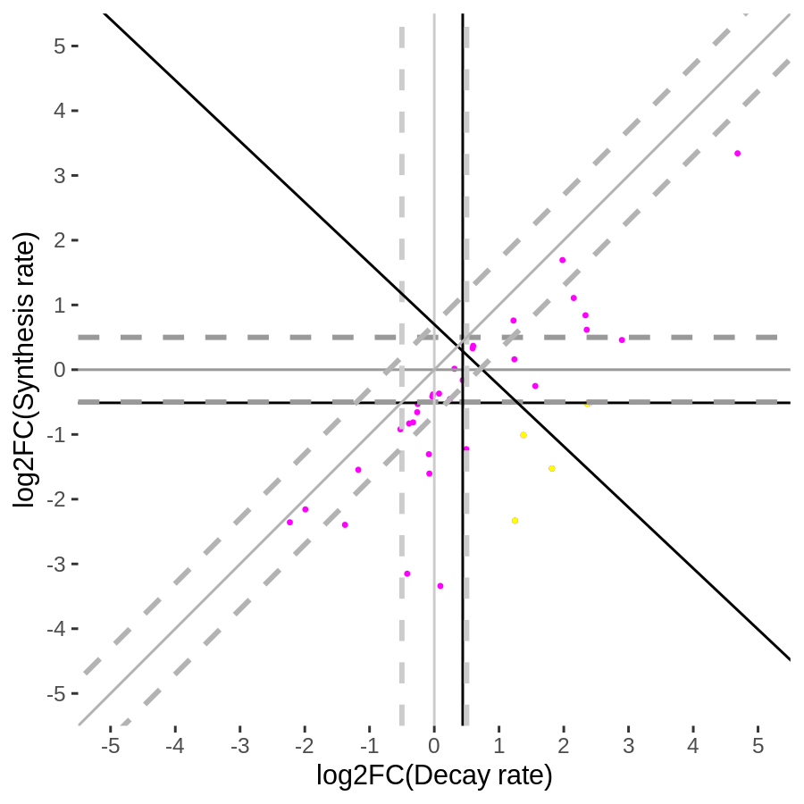

```{r, include=FALSE}
devtools::load_all(".")
```

```{r setup, include = FALSE}
knitr::opts_chunk$set(echo = TRUE,
                      message = TRUE,
                      warning = TRUE)
```


``` {r, echo = FALSE, message = FALSE}
require(rifiComparative)
suppressPackageStartupMessages(library(SummarizedExperiment))
```

## 0. Installation

Required dependencies are cited on README, please make sure they are properly
installed (README).
All functions should be located on the same folder and add them to your 
path directory.

## I. Introduction

rifiComparative is a successor framework of Rifi
*(https://github.com/CyanolabFreiburg/rifi)*. Generated outputs from the same
organism with different treatments could be gene based compared. 
Trying to combine segments of the same gene from different conditions is not 
straight forward and makes the data analysis nearly impossible. Therefore we 
developed a new workflow, rifi comparative data, with an easy strategy to make 
2 conditions comparable. 
The principle of rifi comparative data consists on segmenting the half-life 
(difference between half-life(condition1) and half-life(condition2) 
at probe/bin level) and segmenting intensity using the log2FC(mRNA at time 0). 
The workflow does not apply any hierarchy. Half-life (later HL) and intensity 
segmentation are independent.  
The fragments result of clustering from HL and intensity are compared at
log2FC(log2FC(half-life)/log2FC(intensity)). These values are a pre-analysis for
transcription and post-transcription regulation. Events for each treatment are 
depicted with the position on the genome (For more detail, refer to section xxx).
P-value from statistical tests are estimated. The comparison provides dataframe,
genome plot, scatter plot, heatmaps, histograms and density plot.


## II. Workflow

### 1. Joining data

The first step is combining the data from two conditions. The data are combined
by row on one hand and combined by column on the other hand. Both objects are 
saved and used as input for the next analysis.

The functions used are:

`loading_fun`: you need to set the path for rifi statistics output from
each condition on one side and set the path for home directory where all objects
will be saved on other side. The "cdt" is added referring to the sample 
condition. 

<span style="color:red"> Very important: </span> you will need to run the 
differential expression at probe/bin level. This is the log2FC(intensity) or 
log2FC(mRNA at time 0). Pick-up the logFC, the p_value adjusted, probe position 
and strand columns. Save the first two as 'logFC_int' and 'P.Value'. 
You can use either `left_join` or `right_join` from dplyr package to join 
both data by strand and position. 
<br/><br/>
``` {r loading_fun, eval = TRUE}
inp_s <- rifiComparative:::loading_fun(
    data1 = "../data/stats_se_cdt1.rda", 
    data2 = "../data/stats_se_cdt2.rda", 
    data3 = "../data/differential_expression.rda")[[1]]
print("Head of inp_s")
head(inp_s, 5)


inp_f <- rifiComparative:::loading_fun(
    data1 = "../data/stats_se_cdt1.rda", 
    data2 = "../data/stats_se_cdt2.rda",
    data3 = "../data/differential_expression.rda")[[2]]
print("Head of inp_f")
head(inp_f, 5)
```
<br/><br/>
`joining_data_row`: contains `joining_data_row` function. It gathers 
dataframe from both conditions in one by rows. The object is called 
data_combined_se.rda
<br/><br/>
``` {r joining_data_row, eval = TRUE}
data_combined_minimal <- joining_data_row(
    input1 = inp_s,
    input2 = inp_f)
head(data_combined_minimal, 5)
```
<br/><br/>
`joining_data_column`: contains `joining_data_column` function. It gathers 
dataframe from both conditions in one by columns. The object is called 
df_comb_se.rda
<br/><br/>
``` {r joinging_data_column, eval = TRUE}
df_comb_minimal <- joining_data_column(data = data_combined_minimal)
head(df_comb_minimal, 5)
```

### 2. Penalties

Same as rifi workflow, to get the best segmentation we need the optimal penalties. 
To calculate HL penalty, the difference between half-life from both conditions
is calculated and added as distance_HL column. However the logFC_int is used to 
assign penalties for intensity values and named distance_int. 
`make_pen` function is applied in both cases.

The functions needed for penalty are:

`make_pen` calls one of two available penalty functions to automatically assign
penalties for the dynamic programming. Four functions are called:

 * `make_pen`
 * `fragment_HL_pen`
 * `fragment_inty_pen`
 * `score_fun_ave`

#### 1. `make_pen`

`make_pen` calls one of two available penalty functions to automatically
assign penalties for the dynamic programming. the function iterates over many
penalty pairs and picks the most suitable pair based on the difference between
wrong and correct splits. The sample size, penalty range and resolution as well
as the number of cycles can be customized. The primary start parameters create 
a matrix with n = rez_pen rows and n = rez_pen_out columns with values between
sta_pen/sta_pen_out and end_pen/end_pen_out. The best penalty pair is
picked. If dept is bigger than 1 the same process is repeated with a new matrix
of the same size based on the result of the previous cycle. Only position
segments with length within the sample size range are considered for the
penalties to increase run time. Also, outlier penalties cannot be smaller
than 40% of the respective penalty. For more detail check vignette from rifi
package.
<br/><br/>

#### 2. `fragment_HL_pen`

`fragment_HL_pen` is called by `make_pen` function to automatically assign
penalties for the dynamic programming of half-life fragments. The function used 
for `fragment_HL_pen` is `score_fun_ave`. `score_fun_ave` scores the values of 
y on how close they are to the mean. for more details, see below.
<br/><br/>
``` {r make_pen HL, eval = TRUE}

df_comb_minimal[,"distance_HL"] <-
    df_comb_minimal[, "half_life.cdt1"] - df_comb_minimal[, "half_life.cdt2"]

pen_HL <- make_pen(
    probe = df_comb_minimal,
    FUN = rifiComparative:::fragment_HL_pen,
    cores = 2,
    logs = as.numeric(rep(NA, 8)),
    dpt = 1,
    smpl_min = 10,
    smpl_max = 50,
    sta_pen = 0.5,
    end_pen = 4.5,
    rez_pen = 9,
    sta_pen_out = 0.5,
    end_pen_out = 3.5,
    rez_pen_out = 7
)
```
<br/><br/>

#### 3. `fragment_inty_pen`

`fragment_inty_pen` is called by `make_pen` function to automatically assign
penalties for the dynamic programming of intensity fragments. 
The function used is `score_fun_ave`.

``` {r make_pen int, eval = TRUE}

df_comb_minimal[,"distance_int"] <- df_comb_minimal[,"logFC_int"]

pen_int <- make_pen(
    probe = df_comb_minimal,
    FUN = rifiComparative:::fragment_inty_pen,
    cores = 60,
    logs = as.numeric(rep(NA, 8)),
    dpt = 1,
    smpl_min = 10,
    smpl_max = 50,
    sta_pen = 0.5,
    end_pen = 4.5,
    rez_pen = 9,
    sta_pen_out = 0.5,
    end_pen_out = 3.5,
    rez_pen_out = 7
)
```
<br/><br/>

#### 4. `score_fun_ave`

`score_fun_ave` scores the values of y on how close they are to the mean. 
for more details, see below.
<br/><br/>

### 3. Fragmentation

After finding the optimal set of penalties, fragmentation process could be applied.
The functions used are:
 
 `fragment_HL`
 `fragment_inty`
 `score_fun_ave`

#### 1. `fragment_HL`

`fragment_HL` performs the half_life fragmentation and assigns all gathered 
information to the probe based data frame. The columns "HL_comb_fragment" and 
"HL_mean_comb_fragment" are added to dataframe. `fragment_HL` makes 
half-life_fragments and assigns the mean of each fragment.

``` {r fragment_HL, eval = TRUE}
df_comb_minimal <-
    fragment_HL(
    probe = df_comb_minimal,
    cores = 2,
    pen = pen_HL[[1]][[9]],
    pen_out = pen_HL[[1]][[10]]
)
```
<br/>

#### 2. `fragment_inty`

`fragment_inty` performs the intensity fragmentation and assigns all gathered
information to the probe based data frame. The columns "intensity_comb_fragment"
and "intensity_mean_comb_ fragment" are added to the dataframe. `fragment_inty` 
makes intensity_fragments and assigns the mean of each fragment.
The hierarchy is not followed, fragments from different size could be generated 
independently of half-life fragments.

``` {r fragment_inty, eval = TRUE}
df_comb_minimal <-
    fragment_inty(
        probe = df_comb_minimal,
        cores = 2,
        pen = pen_int[[1]][[9]],
        pen_out = pen_int[[1]][[10]]
    )
```
<br/>

#### 3. `score_fun_ave`

`score_fun_ave` is the score function used by dynamic programming for intensity
fragmentation, for more details, see below.

### 4. Statistics

To check segment significance, t-test with two.sided was used. Each fragment was tested for the number of probes involved in each condition.

``` {r t_test_function_HL, eval = TRUE}
df_comb_minimal <-
    t_test_function(
        data = df_comb_minimal,
        par = "HL",
        par1 = "half_life"
    )
```


``` {r t_test_function_int, eval = TRUE}
df_comb_minimal <-
    t_test_function(
        data = df_comb_minimal,
        par = "intensity",
        par1 = "intensity"
    )
head(df_comb_minimal, 5)
```

### 5. Visualization

The visualization depicts half-life and intensity slots of the fragments result 
of the dynamic programming. Since hierarchy is not applied, the fragments from 
half-life and intensity are independent.

``` {r rifi_visualization_comparison, eval = TRUE}
rifi_visualization_comparison(
    data = data_combined_minimal,
    data_c = df_comb_minimal,
    genomeLength = annot_g[[2]],
    annot = annot_g[[1]]
)
```

Three objects are required:

 data_combined_minimal : data frame from joined data by row.
 df_comb_minimal : data frame from joined data by column
 annot : ggf3 preprocessed (for more information, see below)
 
The plot is located on vignette "genome_fragments_comparison.pdf" and shows 3 sections: annotation, half-life difference and log2FC (mRNA=time0 or intensity).
Either half_life difference or log2FC(intensity), the line 0 indicate no changes between both conditions. Conditions 1 and 2 are indicated by blue and lilac color respectively. Fragments result of dynamic programming are indicated by different colors.
The annotation englobes genome annotation preprocessed by gff3_preprocessing function included on the package and a superposed TU annotation of both conditions from rifi output.

<br/><br/>
``` {r visualization, echo = FALSE, fig.cap = "**genome fragments visualization of both conditions**", out.width = '100%'}
knitr::include_graphics("visualization_cdts.png")
```
<br/>

## III. Outputs

### 1. `adjusting_HLToInt`

`adjusting_HLToInt` function combines HL and intensity fragments generated 
without hierarchy on one hand and the genome annotation on other hand. The first step is adjusting the fragments from HL to intensity and vise-versa and join them to the genome annotation. To make HL and intensity segments comparable, log2FC(HL) is used instead of distance_HL. The fragments should have a significant p_value from t-test at least from one segmentation, either HL or intensity. 

To generate the data frame, two objects are required:

 df_comb_minimal : data frame from joined data by column.
 annot : ggf3 preprocessed (for more information, see below).

The functions used are:

`p_value_function` extracts and return the p_values of HL and intensity segments respectively.

`eliminate_outlier_hl` eliminates outliers from HL fragments.

`eliminate_outlier_int` eliminates outliers from intensity fragments.

`mean_length_int` extracts the mean of the log2FC(intensity) fragments adapted 
to HL_fragments and their lengths.

`mean_length_hl` extracts the mean of log2FC(HL) fragments adapted to the 
intensity fragments and their lengths.

`calculating_rate` calculates decay rate and log2FC(intensity). Both are used to calculate synthesis rate.

The output data frame contains the corresponding columns:

 **position**: position of the first fragment
 **region**:  region annotation covering the fragments
 **gene**: gene annotation covering the fragments
 **locus_tag**: locus_tag annotation covering the fragments
 **strand**: The bin/probe specific strand (+/-)
 **fragment_HL**: Half-life fragments
 **fragment_int**: intensity fragments
 **position_frg_int**: position of the first fragment and the last position of 
 the last fragment.
 **mean_HL_fragment**: mean of the HL of the fragments involved.
 **mean_int_fragment**: mean of the intensity of the fragments involved.
 **log2FC(decay_rate)**: log2FC(decay(condition1)/decay(condition2)).
 **log2FC(synthesis_rate)**: sum of log2FC(decay_rate) and log2FC(intensity).
 **Log2FC(HL)-Log2FC(int)**: sum of log2FC(decay_rate) and log2FC(intensity).
 **intensity_FC**: log2FC(mean(intensity(condition1))/mean(intensity(condition2))).
 **Log2FC(HL)-Log2FC(int)**: sum of log2FC(decay_rate) and log2FC(intensity).
 **p_value**:indicated by "*" means at least one fragment either HL fragment or intensity fragment has a significant p_value.

``` {r adjusting_HLToInt, eval = TRUE}
load("../data/annot_g.rda")
df_mean_minimal <- adjusting_HLToInt(data = df_comb_minimal)
colnames(df_mean_minimal) <-
    c(
        "position",
        "region",
        "gene",
        "locus_tag",
        "strand",
        "fragment_HL",
        "fragment_int",
        "position_frg_int",
        "mean_HL_fragment",
        "mean_int_fragment",
        "log2FC(decay_rate)",
        "Log2FC(HL)-Log2FC(int)",
        "log2FC(synthesis_rate)",
        "intensity_FC",
        "p_value"
    )
#write_xlsx(df_mean_minimal, "df_mean_minimal.xlsx")
```

## IV. Figures


### 1. decay rate vs. synthesis rate plot

The generated data frame "df_mean_minimal" could be used to plot 
log2FC(decay.rate) vs. log2FC(synthesis.rate).

<br/><br/>
``` {r log2FC, echo = FALSE, fig.cap = "**log2FC(Synthesis R/Intensity)**", out.width = '100%'}

```
<br/>
<p align="center">
**Figure 2**: log2FC
</p>

<br/><br/>
``` {r density, echo = FALSE, fig.cap = "**HL density**", out.width = '100%'}
knitr::include_graphics("density_HL.pdf")
```
<br/>
<p align="center">
**Figure 3**: density
</p>


<p align="center">
**Figure 4**: density
</p>


## III. Additional functions

### 1. `score_fun_ave`

`score_fun_ave` scores the difference of the values from their mean.
`score_fun_ave` calculates the mean of a minimum 2 values **y** and substrates
the difference from their mean. The IDs **z** and the sum of differences from
the mean are stored. A new value y is added, the mean is calculated and the new
IDs and sum of differences are stored. After several rounds, the minimum score
and the corresponding IDs is selected and stored as the best fragment.
`score_fun_ave` selects simultaneously for outliers, the maximum number is fixed
previously. Outliers are those values with high difference from the mean, they
are stored but excluded from the next calculation. The output of the function is
a vector of IDs separated by ",", a vector of mean separated by "_" and a
vector of outliers separated by ",".

### 2. `gff3_preprocess`

`gff3_preprocess` processes gff3 file from database, extracting gene names and
locus_tag from all coding regions (CDS). Other features like UTRs, ncRNA, asRNA
ect.. if available and the genome length are extracted. The output is a list of 2 elements.

The output data frame from `gff3_preprocess` function contains the following
columns:

a. *region*: CDS or any other available like UTRs, ncRNA, asRNA
b. *start*: start position of the gene
c. *end*: end position of the gene
d. *strand*: +/-
e. *gene*: gene annotation if available otherwise locus_tag annotation replaces
it
f. *locus_tag*: locus_tag annotation
<br/><br/>
``` {r gff3_preprocess}
# gff3_preprocess(path = gzfile(system.file(
#   "extdata", "gff_e_coli.gff3.gz", package = "rifi"
# )))
# gff3_preprocess(path = gzfile(
#   system.file("extdata", "gff_synechocystis_6803.gff.gz",
#               package = "rifi")
# ))
```
<br/><br/>

``` {r}
sessionInfo()
```